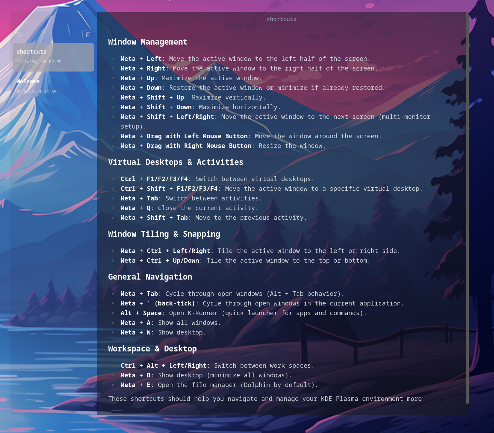

# NoteMark

A Note taking desktop app with out-of-the-box markdown support. Built with Electron and React. Created by [CodeWithGionatha Labs](https://github.com/CodeWithGionatha-Labs). 

Configured glassmorphism styling to work on Linux, as it was only compatible with macOS out of the box. Adjusted it to ensure smooth borders and clear panels for the aesthetic the original developer was going for.



## Project Setup

### Install

```bash
$ yarn
```

### Build

```bash
# For Linux
$ yarn build:linux
```

## Credits
This project is a fork of [NoteMark](https://github.com/CodeWithGionatha-Labs/NoteMark) by [CodeWithGionatha Labs](https://github.com/CodeWithGionatha-Labs).

**Thank you for your amazing tutorial video**
[here](https://www.youtube.com/watch?v=t8ane4BDyC8)
